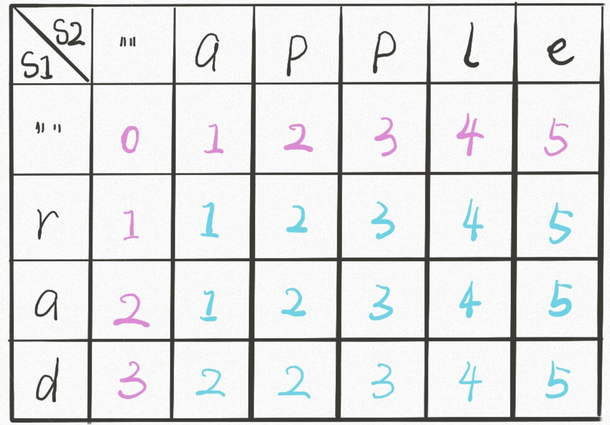

分成5部分:

1. 0/1背包问题
2. 无限背包问题
3. 斐波那契数列问题
4. 回文子串/子序列 系列
5. 最长子串/子序列 系列


- 0/1背包

  - 0/1背包问题

	  ```c++
	  题目: 有n个物品，它们有各自的重量和价值，现有给定容量的背包，如何让背包里装入的物品具有最大的价值总和
	  输入: n, weight[n], vaule[n], package_capability
	  输出: 物品的序号 chosen_item[]
	  ```
	
	  
	
- 纸币问题 (属于斐波那契)
	
	   ```c++
	   [1，5，10]时可以用贪心
	   [1，5，11]时动态规划
	   f(n) = min(f(n-1),f(n-5),f(n-11))+1
	   所以比如求f(15)只要开辟一个int[15],f(0)=0,依次求f(1),f(2)……即可
	   ```
	
	   
	
	- DAG路径问题 (斐波那契)
	
	  ```c++
	  某个点的最有路径 = min{指向该点的其他点} + 入度边cost
	  ```


- 无限背包


- 斐波那契


- 回文


- 最长/最短子串/子序列 

  - 最长上升子序列 (最长子序列系列, 其思想也可以归结为斐波那契, 即决定是由一个一维dp-table以前某个或某几个决定的)

	  ```c++
	  状态转移方程: 
	  f(n) = f(i)+1,其中,i是使得nums[i]<nums[n],离n最近的i;
	  f(n) = 1; 当找不到i
	  ```

	  

	- 最小编辑距离(困难) (最小子串系列, 二维dp-table)

		
	
		```c++
		关键点:
		理解单词A->B的三种操作中,A增加一个字符与B删除一个字符是等价的,比如:
		horse->ros: 
		1. horse->ro + 1; 
		2. hors->ros + 1(这种情况相当于删除horse->ros{*} + 1); 
		3. hors->ro + 0(如果AB最后字符一样)/1; 
		```


