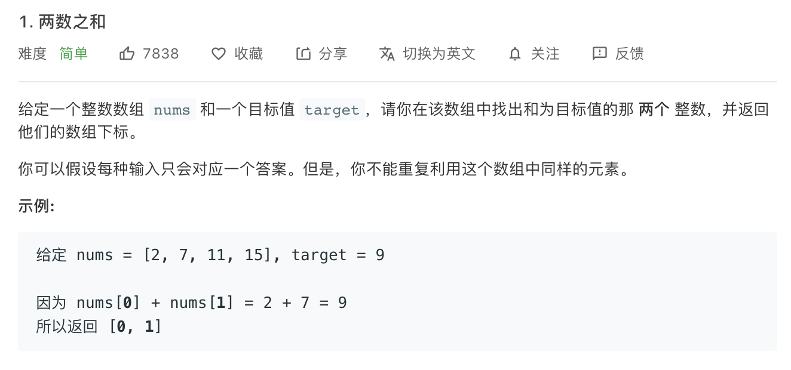

解法1:

```c++
class Solution {
public:
    vector<int> twoSum(vector<int>& nums, int target) {
        int length_nums = nums.size();
        vector<int> ans;
        for(int i=0;i<length_nums;i++){
            for(int j=i+1;j<length_nums;j++){
                if(nums[i]+nums[j]==target){
                    ans.push_back(i);
                    ans.push_back(j);
                }
                //else continue;
            }
        }
        return ans;
    }
};
```


解法2:

```c++
class Solution {
public:
    vector<int> twoSum(vector<int>& nums, int target) {
        unordered_map<int,int> my_map;
        for(int i=0;i<nums.size();i++){
            //my_map.insert(make_pair(nums[i],i));
            my_map[nums[i]]=i;
        }
        //unordered_map<int,int>::iterator it;
        for(int i=0;i<nums.size();i++){
            //it = my_map.find(target-nums[i]);
            if(my_map.find(target-nums[i])!=my_map.end()&&my_map[target-nums[i]]!=i){
                return {i,my_map[target-nums[i]]};
            }
        }
        return {-1,-1};
    }
};
```


解法2（写法2）：

```c++
class Solution {
public:
    vector<int> twoSum(vector<int>& nums, int target) {
        unordered_map<int,int> my_map;
        for(int i=0;i<nums.size();i++){
            my_map.insert(make_pair(nums[i],i));
        }
        unordered_map<int,int>::iterator it;
        for(int i=0;i<nums.size();i++){
            it = my_map.find(target-nums[i]);
            if(it!=my_map.end()&&it->second!=i){
                return {i,it->second};
            }
        }
        return {-1,-1};
    }
};
```


