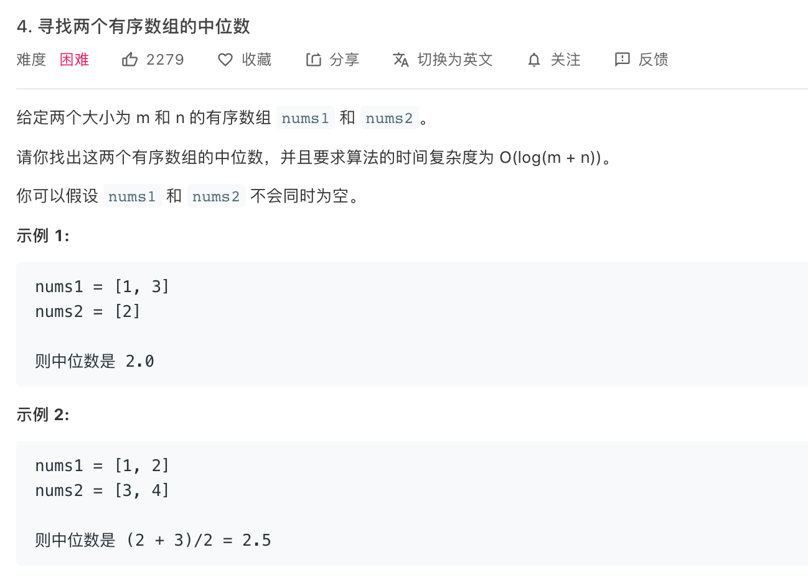

```c++
class Solution {
public:
    double findMedianSortedArrays(vector<int>& nums1, vector<int>& nums2) {
        int length_nums1 = nums1.size();
        int length_nums2 = nums2.size();
        //两个数组均只有1个数
        if(length_nums1==1 && length_nums2==1){
            return ((double)nums1[0]+(double)nums2[0])/2;
        }
        //一个数组一个数，一个数组两个数
        else if((length_nums1==1 && length_nums2==2)||(length_nums1==2 && length_nums2==1)){           
            if (nums1[0]>=nums2[0]) return (double)nums1[0];
            else return (double)nums2[0];
        }
        //总个数5个及以上的奇数个情况
        else if ((length_nums1+length_nums2)%2==1){
            //中位数位第sequence大的数
            int sequence_num = (length_nums1 + length_nums2 +1) / 2;
            //current_num1,2是当前位置标记
            int current_num1 = 0,current_num2 = 0;
            //currnt_num
            int current_max_value=0;
            for(int i = 0;i<sequence_num;i++){
                //nums1的比较小
                if(nums1[current_num1]<=nums2[current_num2]){
                    //先移动current_num1当前位置
                    current_num1++;
                }
                else{            
                    current_num2++;
                }
                //比较现在两个 记录小的
                if(nums1[current_num1]<=nums2[current_num2]){
                    current_max_value = nums1[current_num1];
                }
                else current_max_value = nums2[current_num2];
            } 
            return current_max_value;
        }
        //总个数4个及以上的偶数个情况
        else{
            //中位数位第sequence/2与第(sequence+1)/2两数和的一半
            int sequence_num = (length_nums1 + length_nums2 + 2) / 2;
            //currnt_num1,2还是当前数的位置
            int current_num1 = 0,current_num2 = 0;
            //直接记住最大的两个数的值
            int current_2nd_value = 0, current_1st_value = 0;
            for(int i = 0;i<sequence_num-1;i++){
                if(nums1[current_num1]<=nums2[current_num2]){
                    current_num1++;    
                }
                else{
                    current_num2++;
                }
                if(nums1[current_num1]<=nums2[current_num2]){
                    if(current_1st_value!=0)current_2nd_value = current_1st_value;
                    current_1st_value = nums1[current_num1];
                }
                else{
                    if(current_1st_value!=0)current_2nd_value = current_1st_value;
                    current_1st_value = nums2[current_num2];
                }                
            } 
            return ((double)current_1st_value+(double)current_2nd_value)/2;
        }
    }
};
```