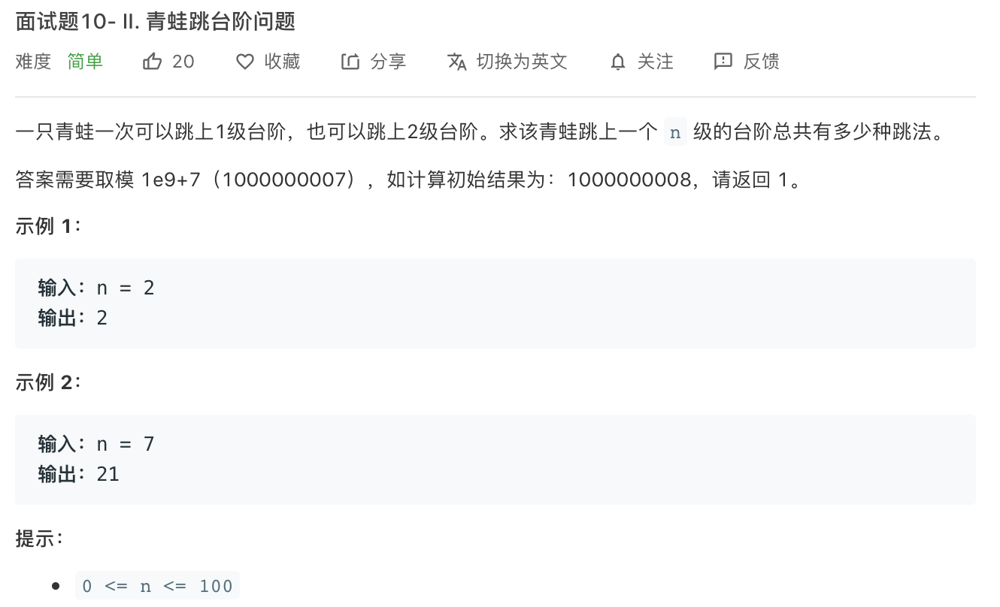

思路和佩波那契数列完全一样


```c++
class Solution {
public:
    int numWays(int n) {
        vector<int> vec_jump(n+1,1);
        for(int i=2;i<=n;i++){
            vec_jump[i] = (vec_jump[i-2]+vec_jump[i-1])%1000000007;
        }
        return vec_jump[n];
    }
};
```


```c++
class Solution {
public:
    int numWays(int n) {
        vector<int> vec_jump;
        vec_jump.push_back(1);
        vec_jump.push_back(1);
        for(int i=2;i<=n;i++){
           vec_jump.push_back((vec_jump[i-2]+vec_jump[i-1])%1000000007);
        }
        return vec_jump[n];
    }
};
```

