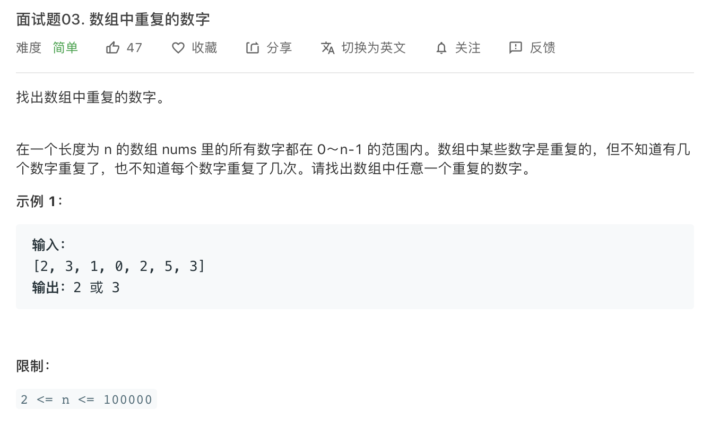

解法一：使用哈希

本质是检索当前数是否已存在表中

```c++
class Solution {
public:
    int findRepeatNumber(vector<int>& nums) {
        int* temp_array = new int [nums.size()];
        unordered_map<int,int> my_map;
        unordered_map<int,int>::iterator it;
        for(int i=0;i<nums.size();i++){
            it = my_map.find(nums[i]);
            if(it != my_map.end()){
                return nums[i];
            }
            else{
                my_map.insert(make_pair(nums[i],i));
            }
        }
        return -1;
    }
};
```


解法二：布尔数组

```c++
class Solution {
public:
    int findRepeatNumber(vector<int>& nums) {
        bool temp_array [nums.size()];
      	memset(temp_array,false,nums.size());//用memset代替for循环更快  
        /*
      	for(int i = 0;i<nums.size();i++){
            temp_array[i] = false;
        }
        */
        for(int i = 0;i<nums.size();i++){
            if(temp_array[nums[i]] == true){
                return nums[i];
            }
            else temp_array[nums[i]] = true;
        }
        return -1;
    }
};
```

